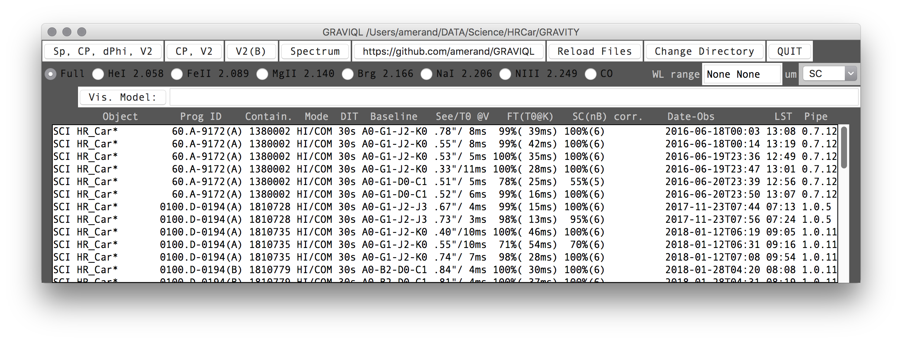

# [VLTI/GRAVITY](https://www.eso.org/sci/facilities/paranal/instruments/gravity.html) reduced and calibrated data Quick Look

A Python 2.7 Tkinter GUI aimed at visualizing VLTI/GRAVITY reduced and calibrated data by the [GRAVITY pipeline](https://www.eso.org/sci/software/pipelines/gravity/gravity-pipe-recipes.html) version 0.9.7 and above.

## Overview

Run [gravi_quick_look.py](gravi_quick_look.py) as a script and select a directory (alternatively, a directory can be given as an argument). The GUI will look like this: 

* The top rows allow to start show the data plots (in Matplotlib). Note the spectra are roughly corrected for telluric features using a synthetic atmospheric model for 2.0mm of water vapor. Spectral ranges can be selected using buttons or by manually entering the range as the boundaries (in um) separated by a space.

* The bottom part of the GUI contains the list of files which can be selected for display, either individually, or averaged. Object' names followed by a ''\*'' indicate data which are reduced and calibrated (as opposed to simply reduced data).

* Columns explanation:
 - Object: name of the SC object (same as FT in single feed)
 - Prog.ID and container: ESO specific
 - Mode: spectral and polarisation model
 - DIT: exposure time of SC
 - Baseline: actual quadruplet used for observation
 - See/T0 @V: Seeing (in arcseconds) and Coherence time (in milliseconds), as measured in visible by the observatory's DIMM
 - FT(T0@K): Fraction of reduced frame for the Fringe Tracker, as well as measured coherence time in K band.
 - SC(nB): Fraction of reduced frames for the Science Channel, as well as number of baseline reduced (can be <6 in bad conditions)
 - Date-Obs: UT time and date of observation
 - LST: local sidereal time

## Limitations
* Tested on MEDIUM and HIGH dispersion modes only.
* Telluric correction is very approximative and only indicative.
* Tested on [Anaconda2](https://www.continuum.io/downloads)/MacOS and [Anaconda2](https://www.continuum.io/downloads)/Linux.

## Dependencies

* Numpy, Matplotlib and Astropy. GUI in Tkinter (standard library).
